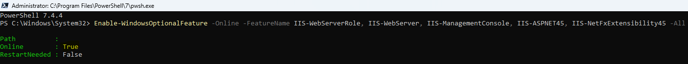
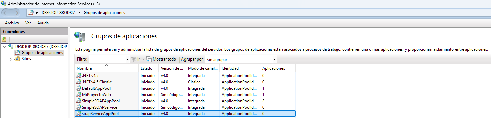
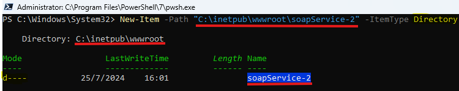
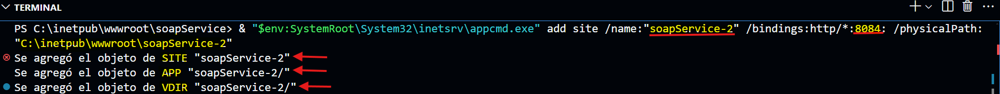
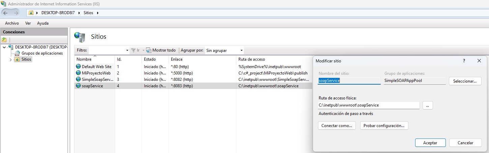
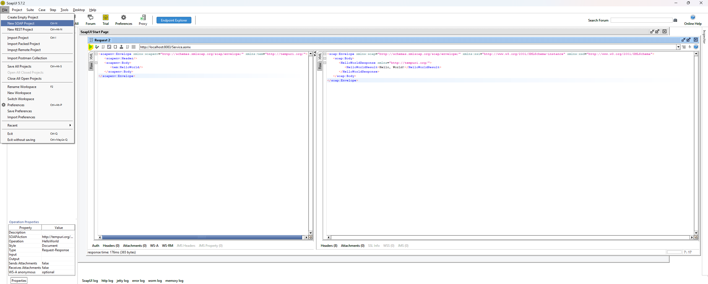

# Configuración de Servicio Web SOAP en IIS

Este documento proporciona una guía rápida con los comandos utilizados para configurar un servicio web SOAP en IIS usando PowerShell y `appcmd.exe`.

## 1. **Clonar el repositorio.**

```git
git clone --recursive --depth=1 https://github.com/OMaciasd/soapService.git
```

## 1. **Instalar IIS y Componentes Necesarios.**

```powershell as Admin
Enable-WindowsOptionalFeature -Online -FeatureName IIS-WebServerRole, IIS-WebServer, IIS-ManagementConsole, IIS-ASPNET45, IIS-NetFxExtensibility45 -All
```



## 2. **Crear el Application Pool.**

```powershell
& "$env:SystemRoot\System32\inetsrv\appcmd.exe" add apppool /name:"soapServiceAppPool"
```



## 3. **Crear el Directorio Físico para el Sitio.**

```powershell as Admin
New-Item -Path "C:\inetpub\wwwroot\soapService" -ItemType Directory
```



## 4. **Crear el Sitio Web en el Puerto 8083.**

```powershell
& "$env:SystemRoot\System32\inetsrv\appcmd.exe" add site /name:"soapService" /bindings:http/*:8083: /physicalPath:"C:\inetpub\wwwroot\soapService"
```



## 5. **Asignar el Application Pool al Sitio Web.**

```powershell
& "$env:SystemRoot\System32\inetsrv\appcmd.exe" set app /app.name:"soapService/" /applicationPool:"soapServiceAppPool"
```



## 6. **Verificar el Servicio Web SOAP.**

- Obtener WSDL:

```powershell
curl -L -v "http://localhost:8083/Service.asmx?WSDL"
```

- Hacer una Llamada SOAP:


